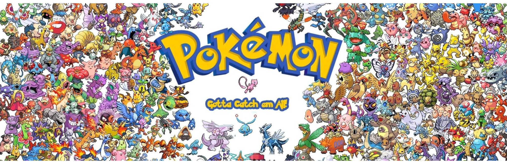
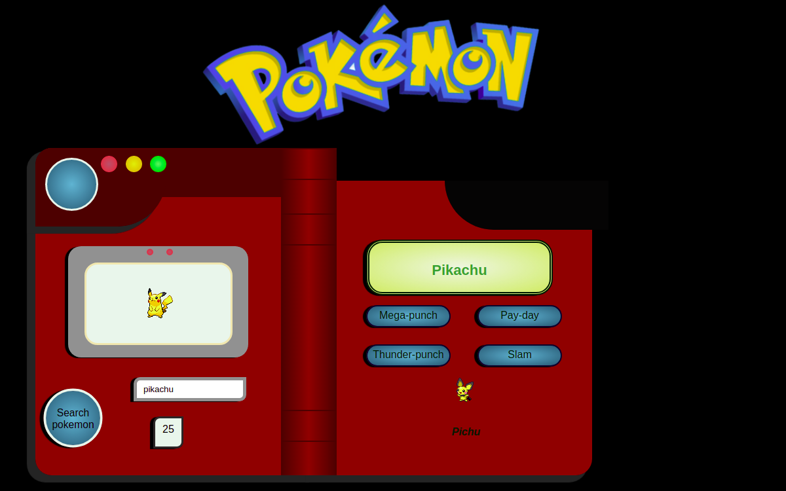

# Challenge-pokemon-php

### A project created by me - a student of BeCode during our very first days of introduction into PHP language.

>[Michaela Harinova](https://github.com/mharin)  

#### This project is based on previous Ajax - Pokedex project created with Java Script language.

### The goal
#### The main point was to get in touch with basic PHP expressions, lean the differences from JS and the behaviour.

> Create a Pokédex with basic functionality in PHP such as:

>* Search a Pokémon by name and by ID
>* Following data about the Pokémon is shown :
   >   * The ID-number
>   * An image (sprite)
>   * 4 "moves"
>   * The previous evolution, _only if it exists_, along with their name and image.

## Layout of Pokedex - name search
#### When searched by name and having previous evolution.

### Detail layout

## Detail layout of Pokedex - ID search
#### When searched by ID and not having previous evolution.

